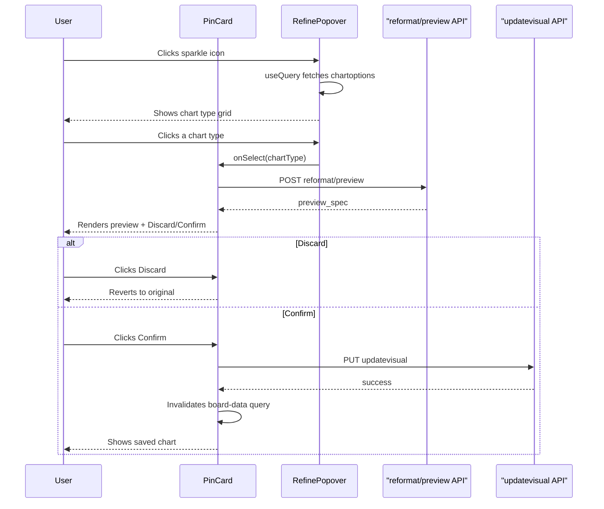

# Refine: Preview, Discard, and Confirm Flow

## User Flow




## Files to Change

### 1. New: `[app/(app)/api/boards/reformat-preview/route.ts](app/(app)/api/boards/reformat-preview/route.ts)`

POST proxy to `${API_BASE_URL}/crafteriq/boards/reformat/preview/{boardId}/{userId}` with body `{ pin_id, chart_type }`. Follows the same pattern as `[app/(app)/api/boards/update/route.ts](app/(app)/api/boards/update/route.ts)`.

### 2. New: `[app/(app)/api/boards/updatevisual/route.ts](app/(app)/api/boards/updatevisual/route.ts)`

PUT proxy to `${API_BASE_URL}/crafteriq/boards/updatevisual/{boardId}/{userId}` with body `{ pin_id, visual_spec }`.

### 3. Modify: `[components/boards/refine-popover.tsx](components/boards/refine-popover.tsx)`

Replace the manual `useState`/`useEffect`/`fetch` pattern with React Query `useQuery`:

```typescript
const { data, isLoading, error, refetch } = useQuery({
  queryKey: ["chart-options", boardId, pinId, userId],
  queryFn: () => fetch(`/api/boards/chartoptions?...`).then(r => r.json()),
  enabled: open,  // only fetch when popover is open
});
```

Remove `chartOptions`, `loading`, `error` local states and the `fetchOptions` callback + `useEffect`. Derive `chartOptions` from `data?.compatible_charts`.

### 4. Modify: `[components/boards/pin-card.tsx](components/boards/pin-card.tsx)` -- main logic

This is the core change. Add preview state and mutation logic inside `PinCard`:

**New state:**

- `previewSpec: VisualSpec | null` -- holds the preview visual spec when a chart type is selected
- `isPreviewing: boolean` -- derived from `previewSpec !== null`

**Preview mutation** (`useMutation`):

- Calls `POST /api/boards/reformat-preview` with `{ boardId, userId, pin_id, chart_type }`
- On success, sets `previewSpec` to the returned `preview_spec` (as VisualSpec)

**Confirm mutation** (`useMutation`):

- Calls `PUT /api/boards/updatevisual` with `{ boardId, userId, pin_id, visual_spec: previewSpec }`
- On success, invalidates `["board-data"]` query via `useQueryClient()`, clears `previewSpec`

**Discard handler:** Simply sets `previewSpec` back to `null`.

**Rendering changes:**

- The `ChatChart` renders `previewSpec ?? visualSpec` -- so when previewing, the chart updates live
- When `previewSpec` is set, show a **Discard / Confirm button bar** at the bottom of the card (above the chart or below it, overlaying the card footer):

```
+-------------------------------+
| Title            [Refine] [..]|
|                               |
|     (chart preview area)      |
|                               |
| [Discard]           [Confirm] |
+-------------------------------+
```

- Discard button: outlined/ghost style
- Confirm button: primary style with loading spinner when confirming
- Both buttons appear with animation (slide in from bottom)

**Prop changes:**

- Remove `onRefine` prop (no longer needed -- PinCard handles everything internally)
- `boardId` and `userId` remain required for the mutations

### 5. Modify: `[components/boards/pin-grid.tsx](components/boards/pin-grid.tsx)`

Remove `onRefine` from `PinGridProps` and from the `PinCard` usage. Only `boardId` and `userId` need to be threaded through.

### 6. Modify: `[app/(app)/Boards/detail/page.tsx](app/(app)/Boards/detail/page.tsx)`

- Remove the `handleRefine` callback (no longer needed)
- Remove `onRefine` from the `PinGrid` props
- Keep passing `boardId` and `userId` to `PinGrid`

